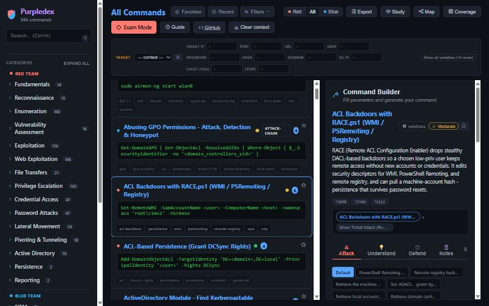
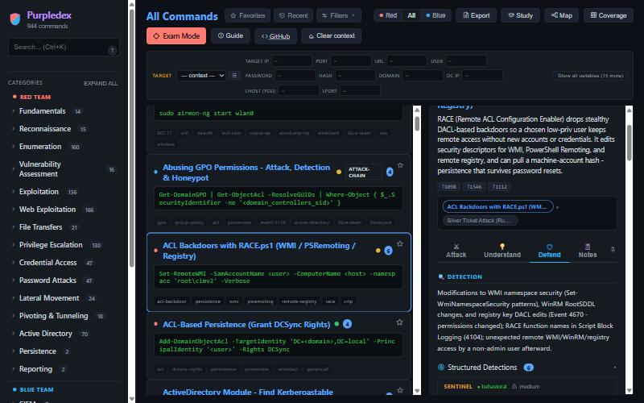
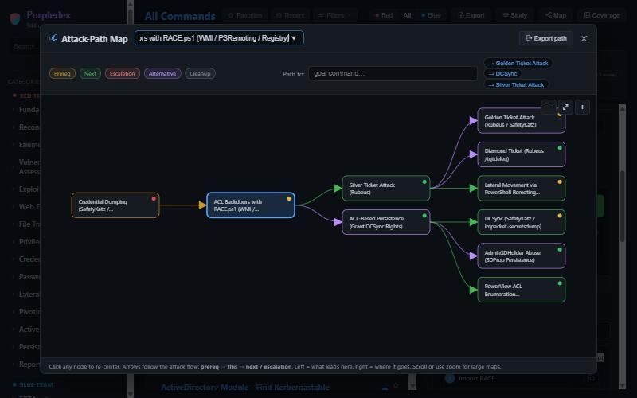
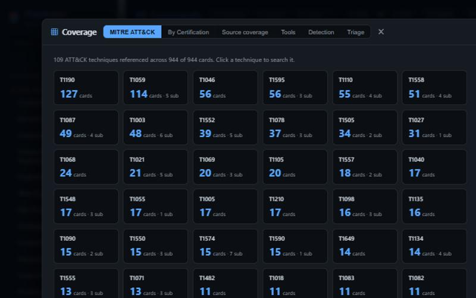

<p align="center">
  
</p>

<h1 align="center">Purpledex</h1>
<p align="center"><strong>Offensive Security Commands + Detection Engineering in One Place</strong></p>

<p align="center">
  <a href="https://purpledex.dev"><strong>purpledex.dev</strong></a>
</p>

<p align="center">
  950 command cards &nbsp;|&nbsp; 1,452 variations &nbsp;|&nbsp; 3,693 detections &nbsp;|&nbsp; 207 MITRE ATT&CK techniques &nbsp;|&nbsp; 428 tools<br>
  Fully offline &nbsp;|&nbsp; No install &nbsp;|&nbsp; No accounts &nbsp;|&nbsp; No telemetry
</p>

---

## What is Purpledex?

Purpledex is a purple-team command library built for people who do penetration testing, detection engineering, or both. Every card is a real command - the kind you actually run during an engagement or write a detection for - with its placeholders turned into fillable fields. Set your target IP, domain, and credentials once, and every command fills in ready to copy.

Each card also carries the blue-team side: MITRE ATT&CK mapping, SIEM detection queries (Splunk SPL, Elastic KQL, Sentinel KQL, Sigma rules), expected log artifacts, and purple-team validation steps. If you can attack it, you should be able to detect it - both sides live on the same card.

It covers **CPTS, OSCP, CWES, CDSA, CRTP, and MCRTA** - built from the actual course material, not scraped from random cheat sheets.



## Who is this for?

- **Pentesters** preparing for OSCP, CPTS, or CRTP who want a fast command builder instead of digging through notes
- **Detection engineers** who need SIEM queries mapped to real attack techniques, not theoretical coverage
- **SOC analysts** who want to understand what an attack looks like from both sides
- **Students** studying for offensive or defensive certifications who need structured study material with flashcards and spaced repetition
- **Purple teamers** who run attack simulations and need the detection validation steps in the same place as the commands

## Features

### Command Builder
Pick a card, fill parameters once, copy a ready-to-run command. Multi-step attack chains fill together, with **Copy all** and **Copy as script** (bash or PowerShell). 1,452 command variations across 950 cards, each with an OpSec noise rating, MITRE ATT&CK tags, and linked attack chains.

### Detection Engineering
794 cards carry defense content across four SIEM platforms. 3,693 structured detections with fidelity ratings (behavioral, signature, telemetry), data source requirements, false positive notes, and confidence levels. Export complete detection packs per platform - ready to import into your Splunk, Elastic, or Sentinel environment.



### Attack-Path Map
Interactive graph showing prerequisites, the current technique, and where it leads next. Color-coded by relationship type (prereq, next, escalation, alternative, cleanup). Trace the shortest chain from any command to a goal like Domain Admin. Export paths as Markdown cheatsheets.



### MITRE ATT&CK Coverage
207 techniques mapped across all cards. Visual heatmap dashboard sorted by coverage density, exportable ATT&CK Navigator layers, and per-technique drill-down. Six coverage tabs: MITRE ATT&CK, By Certification, Source Coverage, Tools, Detection, and Triage.



### Purple-Team Validation
Cards include expected log events, success criteria, test commands, and response playbook steps - everything you need to validate that a detection actually fires when the attack runs.

### Study Mode
Flashcards and quizzes for exam prep. Spaced repetition tracks what you keep missing and resurfaces it across sessions. Scope by certification, category, or favorites.

### Exam Mode
A separate battle-station page with a methodology playbook, host tracker, findings log, and one-click Markdown report export. Push commands directly into findings from any card.

### Search & Filters
Relevance-ranked, typo-tolerant search with field filters: `tool:hydra`, `opsec:loud`, `platform:windows`, `mitre:T1003`, `cat:enumeration`, `tag:pivoting` - combine freely. Three-level category tree, favorites, collections, and personal notes.

### Fully Offline
A single folder of HTML, CSS, and JS. No server, no database, no API calls. Works on an exam VPN with no internet. Installs as a PWA. Everything you personalize stays in your browser's local storage.

## Quick Start

**Option 1 - Use the live site:**
Visit **[purpledex.dev](https://purpledex.dev)** - works immediately, installs as a PWA for offline use.

**Option 2 - Run locally:**
```
git clone https://github.com/farouq7assan0o/PurpleDex.git
```
Open `index.html` in any browser. That's it - no install, no server, no build step.

## How to Use

### 1. Set Your Target
The target bar holds your engagement variables: IP, user, password, domain, DC, LHOST/LPORT, and more. Fill them once and every command auto-fills. Save named engagements to switch between targets (e.g. one per box in the exam).

### 2. Find a Command
Search with `Ctrl+K`, browse the category tree, or filter by certification, tool, MITRE technique, or OpSec level. The `?` button by the search box lists all filter syntax.

### 3. Build & Copy
Click a card to see the filled command. Switch between variations, copy individual commands or entire attack chains as runnable scripts. The OpSec badge shows noise level; MITRE chips link to ATT&CK.

### 4. See the Attack Path
The **Map** button shows an interactive graph of what leads to this technique and where it goes next. Use **Path to** to trace chains to specific goals.

### 5. Check Detections
The **Defend** tab on each card shows SIEM queries, expected artifacts, detection logic, and validation steps. Export detection packs for Splunk, Elastic, Sentinel, or Sigma.

### 6. Study
The **Study** button gives flashcards and quizzes scoped by certification. Weak areas are tracked across sessions with spaced repetition.

### 7. Coverage Dashboard
The **Coverage** button shows MITRE ATT&CK technique coverage, per-certification breakdowns, tool coverage, and detection coverage percentages.

## Coverage

| Certification | Cards | Source |
|---|---|---|
| OSCP (PEN-200) | 732 | OffSec PEN-200 course material |
| CPTS (HTB) | 723 | Hack The Box CPTS path modules |
| CWES (HTB) | 221 | Hack The Box CWES path modules |
| CRTP (Altered Security) | 128 | Altered Security CRTP labs + courseware |
| CDSA (HTB) | 76 | Hack The Box CDSA path modules |
| MCRTA (CWL) | 28 | CyberWarFare Labs MCRTA cloud modules |

## Want More Commands?

Purpledex is actively maintained and I'm adding commands regularly. If there's something missing or a certification you'd like covered:

- **Missing a command?** Open a [GitHub issue](https://github.com/farouq7assan0o/PurpleDex/issues) with the command, what it does, and which cert/module it's from.
- **Have course notes for a cert not covered yet?** Send me the material (Markdown, PDF, or plain text) and I'll turn it into proper cards with detections and attack chains. The more command-rich the notes, the better.
- **Want to add commands yourself?** See the section below.
- **Found a wrong command or bad detection?** Open an issue - accuracy matters more than coverage.

Reach me on [LinkedIn](https://www.linkedin.com/in/FarouqHassan02) or open a GitHub issue.

## Add Your Own Commands

The library is plain JSON cards (one file per command) under `commands/`. Two ways to extend it:

### With an AI coding agent
1. Open the project in Claude Code, Cursor, or similar.
2. Paste the prompt from **[`ADD-COMMANDS-PROMPT.md`](ADD-COMMANDS-PROMPT.md)** with your commands at the bottom. For a whole course module, use **[`NEW-SESSION-PROMPT.md`](NEW-SESSION-PROMPT.md)**.
3. Verify: `npm run check` (build + schema validation + coverage).
4. Commit and redeploy.

### Manually
A card is just JSON with placeholders that auto-fill in the builder:

```json
{
  "id": "smb-share-enum",
  "name": "SMB - List Shares (null session)",
  "command": "smbclient -N -L //<ip>",
  "description": "List SMB shares over a null session.",
  "platform": "linux",
  "type": "command",
  "category": "Enumeration",
  "subcategory": "SMB",
  "certifications": ["CPTS"],
  "opsec": "quiet",
  "tools": ["smbclient"],
  "mitre": ["T1135"]
}
```

Use lowercase placeholders from `js/vars.js` (`<ip>`, `<user>`, `<domain>`, `<lhost>`...) so they auto-fill. Full schema: **[`SCHEMA.md`](SCHEMA.md)** | Authoring guide: **[`AUTHORING.md`](AUTHORING.md)**.

## Tech Stack

Static site, no framework. `index.html` + vanilla JS + CSS. JSON source files build into a single `js/commands.js` bundle via `node build-commands.js`. Hosted on Vercel. Service worker for offline caching.

## Contact

- **LinkedIn:** [FarouqHassan02](https://www.linkedin.com/in/FarouqHassan02)
- **GitHub issues:** open one on this repo

## License

MIT. For **authorized** security testing and education only - you are responsible for how you use it.
